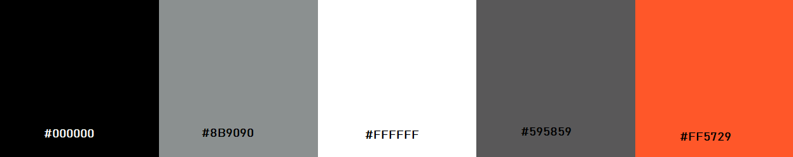

		----	PROYECTO FINAL: PRIMERA ENTREGA	 ----
- - - - - - - - - - - - - - - - - - - - - - - - - - - - - - - - - -- - - - - - - - - - - - - - - - -- - - - - - - - - - - - - - - - -
I. Descripción: 

	Se solicita realizar una página web para la comuna de Quilicura, el tema elegido es una página estilo "Tripadvisor", la cual
tendrá la funcionalidad de ser una guía turística de la comuna de Quilicura, tanto para los vecinos de la misma como para los visitantes
 de otras comunas y/o turistas.
	Como mínimo debe contener temas referentes a la comuna sobre: 
	- Hitos históricos
	- Gastronomía
	- Arquitectura
	- Arte callejero
	- Lugares imperdibles
	- Contacto

II. Instrucciones:

	En la primera entrega se definirá el diseño de la página en cuanto a colores, tipos de fuentes, como se recopilará la 
información del contenido, la estructura de la página y como entregables se enviará:

	1. Sketch y mockup escritorio
	2. Sketch  y mockup móvil
	3. Un maqueta con estructura HTML y CSS
	4. Requerimientos del sitio
	5. Guía de estilos
	6. Tipo de fuentes

III. Objetivos de la interfaz (UI):

	Entregar al usuario la información turística de la comuna de Quilicura, en cuanto:

	1. Hitos históricos: Mostra hechos que han marcado la historia y desarrollo de la comuna, mostrando imagenes e historias.
	2. Gastronomía: Entregar al usuario información como ubicación, resaña, productos, etc., sobre "picadas" para comer, restaurantes, 
	carritos de comida (food truck), pub, entre otros. A portar a los pequeños negocios como plataforma de publicidad.
	3. Arquitectura: Mostar al usuario la evolución de la arquitetura de la comuna en el tiempo, en cuanto a la construcción de micro 
	barrios, casonas antiguas, parques industriales, etc.
	4. Arte callejero: Informar al usuario sobre proyectos realizados en cuanto a pintado de murales y donde pueden vistarlos, entre otras actividades.
	5. Lugares imperdibles: Mostrar los lugares que pueden visitar, su ubicación, información de contacto, horarios de apertura al publico, etc., 
	de parques, plazas, cines, centros comerciales, cementerio, entre otros.
	6. Actividades culturales: Informar sobre las actividades culturales que se realizaran en la comuna, como festivales, conciertos, obras de teatro, 
	exposiciones, para que así el usuario pueda informarse para vistitar la comuna en dichas fechas, según sus intereses.
	7. Transporte: Entregar información al ususario sobre los distintos medios de transportante, tanto para acceder a la comuna, como para la movilización 
	dentro de esta.
	8. Contacto: Entregar una sección de contacto, para consultas, comentarios y/o sugerencias, para así poder tener un feedback con el usuario y poder
	mejorar el sitio web, según las inquietudes y aportes de la comunidad.

IV. Objetivos experiencia usuario (UX):

	La página será estilo blog, sencilla con la información necesaria para ser una buena guía turística de la comuna para el usuario, dandole más enfásis a 
imágenes y grafica que a laintroducción de textos extensos, para así llamar la atención y motivar al usuario a ver por sus propios ojos y vivir la 
experiencia de conocer 	presencialmente la comuna.
	En la página de inicio se mostará la última información o la más reevantes, sobre cada una de las secciones (historia, gastronomía, arquitectura, 
arte callejero, lugares que visitar, etc.), al hacer click sobre una de las secciones se realizará el link, par dirigir al usuario al resto de la información
de la sección elegida.
	
	El usuario podrá interactuar en la página mediante un menú con botones para seleccionar la seccion que quiera visitar, además de hacerlo mediante imágenes tipo thumbainls
mostrar imagenes de los temas de cada sección.

	En el banner principal de la pagina de inicio se mostraran temas actualizados o de mayor relevancia, en el centro irá el logo de municipalidad.
	En la barra de navegación se incluira los números de contacto de seguridad ciudadana y plan cuadrante y en un costado el link a redes sociales de la comuna,
mediante iconos que la representen.
	
v. Requerimientos del sitio:

1. Generales:
	- Layout: Página estilo blog, con la utilización de grillas de 1 a 3 columnas, responsive.
	- La estructura de las páginas sera de: Una barra de navegación, un header, una o dos secciones y un footer.
	- La guía de estilo se adjunta en:

		

	- El sketch de escritorio y móvil es:

		
		
	- El mockup de escritorio y móvil es:

		![](images/Mockup.pdf

	- Para la estructura HTML y CSS, se usará Boostrap
	- Imágenes: se realizará un reportaje fotográfico en terreno, para obtener imágenes actualizadas y reales.
	- Recopilación de información: Para el contenido se entrevistará a vecinos de la comuna mediante una encuesta.

 2. Específicos:

	- Estructura:

		- Se usará estructura base de boostrap.

		- Barra de navegación: 
			- color fondo: #FF5729
			- Tipo y color de fuente: #8B9090
			- Contenido: numeros telefonicos de seguridad ciudadana y plan cuadrante, más link para pagina de inicio, mapa de la comuna y formulario de contacto
			

		- Header: 
			- Para la página de inicio irá un banner slide tipo carousel con width 100%, mostrando imagens o videos, con el logo de la municipalidad en el centro.
			- Para cada sección será grilla de 12 columnas, con container, sobre la imágenes irá el nombre de la sección.
			- Tipo y color de fuente: Shrikhand-Regular #000000

		- Secciones:
			- Se usará grillas de 2 a 3 columnas con imágenes tipo thumbainls, bajo la imagen el titulo de tema y un resumen.
			- Color fondo: blanco	

		- Footer:
			- color fondo: #595859
			- Tipo y color de fuente: Montserrat #FF5729
			- Contenido:Escritorio: Formulario de contacto y link para volver a la parte superior de la página
				    Móvil: iconos redes sociales y link para volver a la parte superior de la página

	- Estilos:
		- Se usará CSS y para las clases se usará metodología BEM, aplicando estilos según la guía de estilos entregada en la 
		sección de requerimientos generales.

	- Contenido:
		- Para el  contenido se utilizará información real y lo más actualizda posible, para lo cual se utilizara la recopilación de información de la encuesta a los
		vecinos de la comuna, la obtenida en el reportaje fotográfico en terrreno y de una revisión bibliografia en sitio web de la municipalidad.
	

	- Imágenes:
		- Seran relaes y se inlcuirán en la carpeta images, dentro de la carpeta css (css/images).
	

	- El proyecto se encuentra en Github, en el siguiente link: 
		https://github.com/Andyta2018/Proyecto_Final_V01
